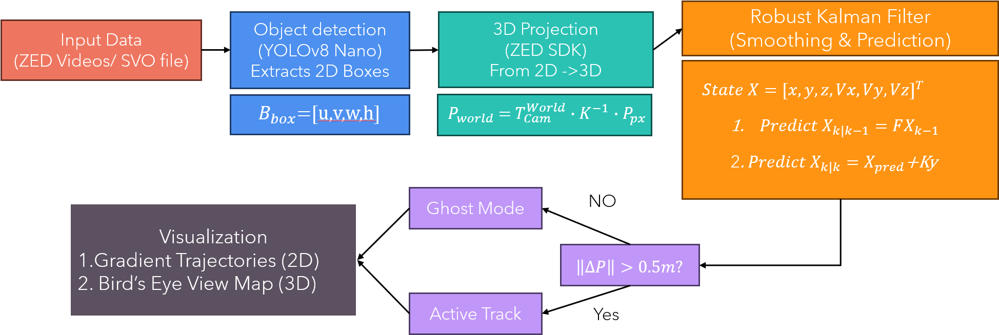

# Vision-Based Dynamic Objects Path Prediction for Safer Robot Navigation on Construction Sites

**Authors:**
* **Liqun Xu** (Department of Civil and Environmental Engineering, UW-Madison)
* **Pakorn Boonpetch** (Department of Materials Science and Engineering, UW-Madison)

---

## 1. Motivation

Construction sites are inherently dynamic and hazardous environments. For autonomous agents to operate safely alongside human workers and heavy machinery, they require robust capabilities to perceive and predict the movement of surrounding objects.

* **The Problem:** Traditional static surveillance cameras fail to capture the dynamic, **egocentric perspective** (first-person view) that a mobile robot experiences.
* **The Gap:** Existing datasets often lack the specific environmental constraints and unpredictable interactions found in active construction zones.
* **Our Goal:** To bridge this gap by collecting high-fidelity field data from a quadruped robot's perspective and developing a vision-based motion prediction system. This aligns with modern robotic perception benchmarks (like JRDB), emphasizing the need for data collected from the robot's own moving perspective to enable proactive accident prevention.

---

## 2. Approach: Field Data Collection

To ensure the authenticity of our data, we deployed a mobile robotic platform on an active construction site at the **University of Wisconsin-Madison (Kellner Family Athletic Center)**.

### Robotic Platform
We selected the **Unitree B2 Commercial Quadruped Robot** for this task.
* **Mobility:** Its legged design allows it to navigate the uneven terrain, gravel, and obstacles typical of construction sites better than wheeled robots.
* **Endurance:** A battery life of **4-5 hours** allowed for extended, uninterrupted recording sessions.

### Sensor Suite
* **Visual Perception:** The robot was equipped with a **ZED 2i Stereo Camera**. This sensor provided both high-definition RGB video and depth sensing capabilities, which are essential for 3D spatial mapping and localization.

### Collection Strategy
Instead of static recording, we employed a **Randomized Waypoint Navigation** strategy:
1.  The robot was manually navigated between randomly selected points across the site.
2.  Routes included diverse zones such as **material storage areas** and **active machinery routes**.
3.  This ensured the dataset captured the unpredictable nature of real-world construction workflows.

*> The Unitree B2 robot equipped with the ZED 2i camera used for field data collection.*

---

## 3. Implementation: The Robust Tracking Pipeline

We developed a custom "Tracking-by-Detection" pipeline to convert raw, unstructured video data into structured trajectory datasets suitable for training predictive models.

### A. Object Detection & Localization
* **Detection Model:** We utilized **YOLOv8 Nano** to identify dynamic agents (workers and vehicles) in each video frame. This replaced our initial zero-shot approach to improve real-time performance.
* **3D Localization:** Using the ZED 2i's depth map, we calculated the 3D coordinates for each detected object relative to the robot.

### B. Tracking & Noise Filtering
To handle the noisy environment of a construction site, we implemented a robust tracking logic:
* **State Estimation:** A **6-state Kalman Filter** was used to track the position and velocity of agents over time.
* **The "Jitter Filter" Heuristic:** A novel filtering step was introduced to handle sensor noise.
    * *Logic:* If an object's displacement is under **0.5 meters**, the system suppresses its velocity vector.
    * *Benefit:* This successfully enables **'Active Track'** for truly moving workers while preventing false alarms (or "Ghost mode") caused by slight sensor fluctuations on static objects.

### C. Dataset Formulation
The pipeline processes the video frames to generate a supervised learning dataset $\mathcal{D}$:
1.  **Centroid Calculation:** For each tracked object $i$, the bounding box centroid $(u, v)$ is computed.
2.  **Sequence Aggregation:** Coordinates are aggregated by unique IDs.
3.  **Data Splitting:** Each trajectory is partitioned into **Observation ($X$)** (History) and **Ground Truth ($Y$)** (Prediction Target).

*> Algorithm logic flow for generating trajectory datasets from raw video inputs.*

---

## 4. Results: Qualitative Analysis

The primary outcome of this project is a verified end-to-end pipeline and a baseline trajectory prediction model. Due to time constraints preventing large-scale ground-truth annotation, we focused on **Qualitative Assessment** via Bird's Eye View (BEV) reconstruction.

### Key Findings from Visualization
The trained model was deployed on a hold-out test set, and predictions were projected onto a 2D map:

* **Plausible Path Planning:** As shown in the visualization below, the system successfully generates future path plans (colored lines) extending from the agents.
* **Constraint Learning:** The model demonstrates an understanding of the site's physical constraints. Predicted paths generally adhere to navigable open spaces, avoid static obstacles, and follow the natural flow of movement.

*> BEV reconstruction showing the model's predicted paths (colored lines) for workers and machinery, respecting site boundaries.*

---

## 5. Discussion: Challenges & Interesting Findings

Throughout the implementation and testing phases, we encountered several specific challenges that provide insight for future improvements:

### 🔍 Finding 1: Occlusion Handling
In crowded zones, dynamic occlusion was a significant issue. When large machinery passed between the robot and a worker, the tracking continuity was often interrupted, leading to **fragmented trajectory inputs**. This highlights the need for memory-based tracking architectures in future iterations.

### 🔍 Finding 2: Environmental Variance
Construction sites have extreme lighting conditions. We observed that transitions from **direct sunlight to building shadows** occasionally affected the consistency of the detection module, introducing noise into the coordinate data. This validates our decision to implement the "Jitter Filter" mentioned in the Implementation section.

### 🔍 Finding 3: Complex Social Interactions
Our current baseline model treats agents independently. However, our qualitative analysis revealed complex interactions, such as **a worker pausing to let a vehicle pass**. The current model does not fully capture this social etiquette, suggesting that future models need "Interaction-Aware" components.

---

## 6. Future Work

To advance this system towards deployment readiness, we propose the following steps:
1.  **Social Pooling:** Integrate social pooling mechanisms (e.g., Social-LSTM or Social-GAN) to explicitly model agent-to-agent interactions.
2.  **Dataset Expansion:** Collect data under diverse weather conditions to improve the robustness of the detection and tracking modules.

---
*University of Wisconsin - Madison | CS566 Final Project*
